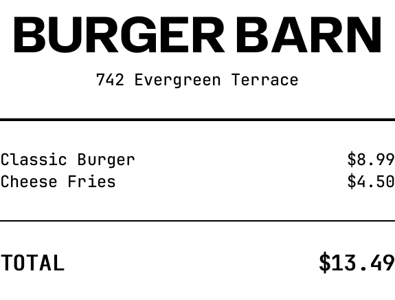

# Rip

A markup language for receipts. Parse it, render it to pixels, HTML, plain text, or ESC/POS binary.

Jump to: [Syntax](#syntax) · [JavaScript Quick Start](#javascript-quick-start) · [CLI Quick Start](#cli-quick-start) · [Rust Quick Start](#rust-quick-start)

```
#### BURGER BARN ####
|> 742 Evergreen Terrace <|

===

| Classic Burger  |>   $8.99 |
| Cheese Fries    |>   $4.50 |

---

++ | *TOTAL*      |> *$13.49* | ++

@cut()
```



## Syntax

See [SPEC.md](SPEC.md) for the full language reference. The short version:

- **Text**: just type it
- **Styles**: `*bold*` `_underline_` `` `italic` `` `~strikethrough~`
- **Sizes**: `## header ##` (more `#` = bigger), `++ body ++` (more `+` = bigger)
- **Columns**: `| left | right |` with `>` / `<` for alignment
- **Dividers**: `---` thin, `===` thick, `...` dotted
- **Directives**: `@image()` `@qr()` `@barcode()` `@cut()` `@feed()` `@drawer()` `@style()` `@printer-width()` `@printer-dpi()`

## JavaScript Quick Start

```bash
npm install rip-receipt
```

```javascript
import { Rip } from 'rip-receipt';

// HTML — standalone document with inline styles and SVG barcodes/QR
const html = await Rip.renderHtml("## Hello\n---\n| Item |> $5.00 |");

// Plain text
const text = await Rip.renderText("## Hello\n---\n| Item |> $5.00 |");

// Grayscale pixels — { width, height, pixels: Uint8Array, dirtyRows }
const img = await Rip.renderPixels(markup);

// 1-bit packed pixels (for thermal printers)
const raster = await Rip.renderRaster(markup);

// ESC/POS binary commands
const escpos = await Rip.renderEscpos(markup);
```

Images and fonts referenced in markup are fetched automatically. In Node.js, install `sharp` as an optional dependency for image decoding.

## CLI Quick Start

```
cargo install --path rip_cli

rip receipt.rip output.png      # grayscale PNG
rip receipt.rip output.html     # HTML
rip receipt.rip output.txt      # plain text
rip receipt.rip output.bin      # ESC/POS binary
rip receipt.rip output.raster   # 1-bit packed raster
rip receipt.rip --bench         # benchmark all renderers
```

## Rust Quick start

```rust
let nodes = rip::parse("## Hello\n---\n| Item |> $5.00 |");
let resources = rip::RenderResources::default();

// Grayscale pixels
let img = rip::render_luma8(&nodes, &resources).unwrap();
// img.width, img.height, img.pixels (row-major luma8)

// HTML
let html = rip::render_html(&nodes);

// Plain text
let text = rip::render_text(&nodes);

// ESC/POS binary (thermal printer commands)
let escpos = rip::render_escpos(&nodes, &resources);
```

## Crates

| Crate | What it does |
|---|---|
| `rip` | Unified API — start here |
| `rip_parser` | Parses `.rip` markup into an AST |
| `rip_image` | Renders to grayscale pixels |
| `rip_html` | Renders to standalone HTML |
| `rip_text` | Renders to plain text |
| `rip_escpos` | Renders to ESC/POS binary |
| `rip_cli` | CLI tool for rendering files |
| `rip_wasm` | WASM + JS wrapper → npm [`rip-receipt`](https://www.npmjs.com/package/rip-receipt) |
| `rip_android` | Android/Kotlin bindings via JNI |

## How images work

The core library doesn't decode images. The host (your app) decodes PNG/JPEG/whatever into grayscale pixels and hands them over via `RenderResources`:

```rust
use rip::{parse, collect_resources, RenderResources, ImageData};

let nodes = parse("@image(logo.png)");
let urls = collect_resources(&nodes);

let mut resources = RenderResources::default();
for url in &urls.images {
    // You decode this however your platform does it
    let (width, height, pixels) = decode_image(url);
    resources.images.insert(url.clone(), ImageData { width, height, pixels });
}

let output = rip::render_luma8(&nodes, &resources).unwrap();
```

This keeps the core dependency-free from image codecs, which matters for WASM, Android, and embedded targets.

## License

MIT OR Apache-2.0

## LLM Use

Claude Code was heavily used in the creation of the code in this project.